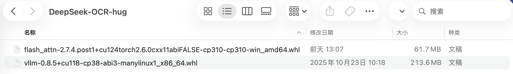

<div align="center">
  
</div>


<hr>
<div align="center">
  <a href="https://www.deepseek.com/" target="_blank">
    
  </a>
  <a href="https://huggingface.co/deepseek-ai/DeepSeek-OCR" target="_blank">
    
  </a>

</div>

<div align="center">

  <a href="https://discord.gg/Tc7c45Zzu5" target="_blank">
    
  </a>
  <a href="https://twitter.com/deepseek_ai" target="_blank">
    
  </a>

</div>


<p align="center">
  <a href="https://huggingface.co/deepseek-ai/DeepSeek-OCR"><b>📥 Model Download</b></a> |
  <a href="https://github.com/deepseek-ai/DeepSeek-OCR/blob/main/DeepSeek_OCR_paper.pdf"><b>📄 Paper Link</b></a> |
  <a href="https://arxiv.org/abs/2510.18234"><b>📄 Arxiv Paper Link</b></a> |
</p>
<p style="font-size: 18px;">
DeepSeek-OCR是深度求索（DeepSeek）基于前沿深度学习技术开发的多模态文字识别系统。该系统通过AI模型实现对图像/视频中文字信息的精准检测、识别与结构化处理。与依赖固定规则的传统OCR不同，DeepSeek-OCR整合了计算机视觉（CV）、自然语言处理（NLP）和多模态大模型技术，能够智能理解文字上下文，显著提升识别准确率。
此外，DeepSeek-OCR开创性地提出了"光学压缩"概念：将文本转化为图像，用仅需10-20%的视觉token即可表示相同内容。这种创新方式有效解决了大语言模型（LLM）处理长文本的瓶颈。其三级架构（局部感知→内容压缩→全局理解）有望重塑未来LLM的输入模式，使像素成为比文本更高效的信息载体。
</p>

## 1️⃣ 项目环境安装
1. 从 GitHub 获取 Deepseek-OCR 项目
```bash
git clone https://github.com/deepseek-ai/DeepSeek-OCR.git
```
2. 可以从Hugging Face或国内ModelScope平台下载，更推荐使用ModelScope进行下载
```Shell
#先通过如下命令安装ModelScope
pip install modelscope
#下载完整模型库
modelscope download --model deepseek-ai/DeepSeek-OCR
```
3. 搭建虚拟环境
```Shell
conda create -n deepseek-ocr python=3.12.9 -y
conda activate deepseek-ocr
```

4. 安装依赖库

- 下载 vllm-0.8.5 [whl](https://github.com/vllm-project/vllm/releases/tag/v0.8.5) 
```Shell
pip install torch==2.6.0 torchvision==0.21.0 torchaudio==2.6.0 --index-url https://download.pytorch.org/whl/cu118
pip install vllm-0.8.5+cu118-cp38-abi3-manylinux1_x86_64.whl
pip install -r requirements.txt
```
5. 安装 flash-attn==2.7.3

-  由于依赖包需从GitHub下载，可能会遇到编译时间过长的问题。建议直接从flash-attention官方GitHub仓库下载对应版本的.whl预编译包进行离线安装
- 请下载与本地环境匹配的whl文件，建议选择cxx11abiFALSE版本。若选择cxx11abiTRUE版本，可能导致后续使用时出现报错问题。
<div align="center">
  
</div>

- 将本地下载的flash_attn和vllm的依赖包上传到服务器，使用pip install命令安装.whl文件。
```Shell
pip install *.whl
```
## 2️⃣ 项目运行
1. 参数配置
进入/root/autodl-tmp/deepseek-TBocr/DeepSeek-OCR/DeepSeek-OCR-master/DeepSeek-OCR-vllm目录下的config.py文件，配置以下参数：
  - MODEL_PATH （模型文件路径）
  - INPUT_PATH  （待上传图片、PDF路径）
  - OUTPUT_PATH （结果保存文件夹路径）
  - PROMPT （所需提示词）
```Shell
BASE_SIZE = 1024
IMAGE_SIZE = 640
CROP_MODE = True
MIN_CROPS= 2
MAX_CROPS= 6 # max:9; If your GPU memory is small, it is recommended to set it to 6.
MAX_CONCURRENCY = 100 # If you have limited GPU memory, lower the concurrency count.
NUM_WORKERS = 64 # image pre-process (resize/padding) workers 
PRINT_NUM_VIS_TOKENS = False
SKIP_REPEAT = True
MODEL_PATH = '/root/autodl-tmp/deepseek-TBocr/deepseek-ai/DeepSeek-OCR' #模型文件路径
INPUT_PATH = '/root/autodl-tmp/deepseek-TBocr/DeepSeek-OCR/image/18.png' #待上传的图片/pdf路径
OUTPUT_PATH = '/root/autodl-tmp/deepseek-TBocr/DeepSeek-OCR/result/017' #结果保存文件夹路径
PROMPT = '<image>\n<|grounding|>Convert the document to markdown.' #默认提示词
```

在单GPU（GPU 0）环境下运行时，请打开run_dpsk_ocr_image.py和run_dpsk_ocr_pdf.py文件，找到以下参数配置。
<div align="center">
  
</div>


1. 藏文图像检测识别
```Shell
cd DeepSeek-OCR-master/DeepSeek-OCR-vllm
python run_dpsk_ocr_image.py
```
运行成功后，将在结果文件夹中生成以下内容：一个包含非文字图像的images文件夹、两个Markdown格式的内容识别文件，以及一张名为result_with_boxes.jpg的区域检测结果图。
<div align="center">
  
</div>

<div align="center">
  
</div>

<div align="center">
  
</div>

2. 藏文PDF检测识别

18页的藏文PDF文档在十几秒内完成了精准检测识别，多语言处理能力令人惊叹，且完美保留了原始排版顺序
```Shell
python run_dpsk_ocr_pdf.py
```
<div align="center">
  
</div>


